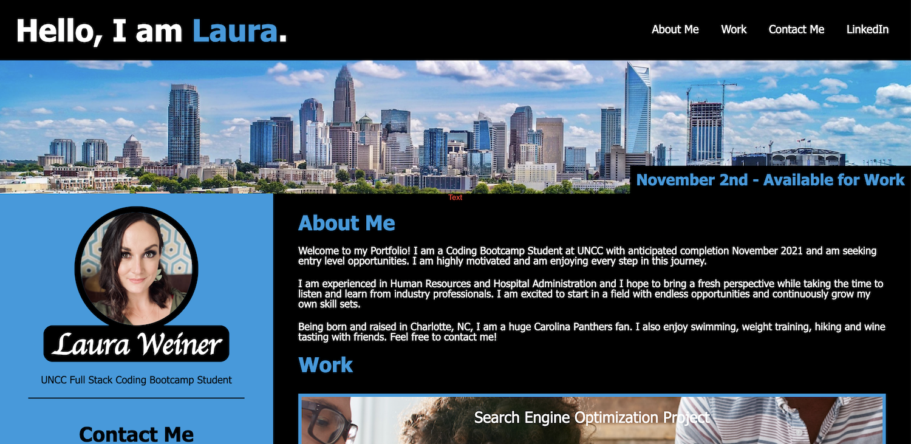

# Portfolio Webpage Project

[Link to finished website](https://lweine01.github.io/portfolio-webpage-project/)

## Table of Contents
- [Description](#Description)
- [Screenshot](#Screenshot)
- [Usage](#Usage)
- [Language](#language)

## Description
In this homework assignment I created my first professional portfolio. This includes my name, picture and contact information. The nav bar has links to jump down to the About Me, Work and Contact Me section and my LinkedIn profile. The work section includes links to my published works as well as spaceholders for future projects. This also has a responsive layout that adapts to different viewports. 

## Screenshot

## Usage
Provides a professional portfolio to showcase to potention employers in the future.

## Language
HTML and CSS
